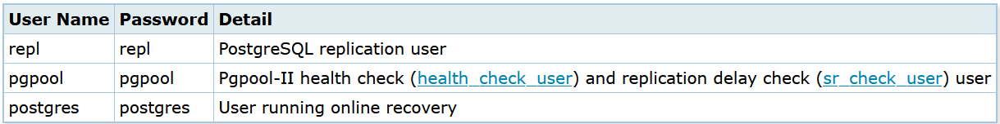

# Configuration Failover

### installation
```
apt install postgresql-16-pgpool2 postgresql-16-pg-failover-slots sudo pgpool2 -y
```

### Create archive dir for archive mode on all server
```
# mkdir -p /var/lib/pgsql/archivedir
# chown -R postgres:postgres /var/lib/pgsql/archivedir
```

### Edit file posgresql.conf on server master
```
# vim /etc/posgresql/13/main/postgresql.conf

listen_addresses = '*'
archive_mode = on
archive_command = 'cp "%p" "/var/lib/pgsql/archivedir/%f"'
wal_level = replica
hot_standby = on
wal_log_hints = on
```

### create users on server master

```
# su - postgres
$ psql
=# SET password_encryption = 'scram-sha-256';
=# CREATE ROLE pgpool WITH LOGIN;
=# CREATE ROLE repl WITH REPLICATION LOGIN;
=# \password pgpool
=# \password repl
=# \password postgres
=# GRANT pg_monitor TO pgpool;
```

### edit file pg_hba.conf on all server
```
# vim /etc/postgresql/13/main/pg_hba.conf
//tambahkan command dibawah pada bagian paling bawah
host    all             all             netserver                 scram-sha-256
host    replication     all             netserver                 scram-sha-256
```

### Create ssh pubkey on all server

Untuk menggunakan automated failover dan recovery kita perlu mengallow ssh pubkey.
pertama set password untuk user postgres untuk *semua server*
```
# passwd postgres
```

create pubkey pada *semua server*
```
# ssh-keygen -t rsa
# ssh-copy-id postgres@server1
# ssh-copy-id postgres@server2
# ssh-copy-id postgres@server3

# su - postgres
$ ssh-keygen -t rsa
$ ssh-copy-id postgres@server1
$ ssh-copy-id postgres@server2
$ ssh-copy-id postgres@server3
```
### create pgpass file on all server
.pgpass file ini digunakan untuk auth repl user tanpa harus memasukkan password lagi untuk streaming replication dan online recovery. Jadi kita tidak perlu lagi specified password pada postgresql.conf
```
# su - postgres
$ vim /var/lib/postgresql/.pgpass

server1:5432:replication:repl:<repl user password>
server2:5432:replication:repl:<repl user password>
server3:5432:replication:repl:<repl user password>
server1:5432:postgres:postgres:<postgres user password>
server2:5432:postgres:postgres:<postgres user password>
server3:5432:postgres:postgres:<postgres user password>
$ chmod 600 /var/lib/postgresql/.pgpass
```

### 

