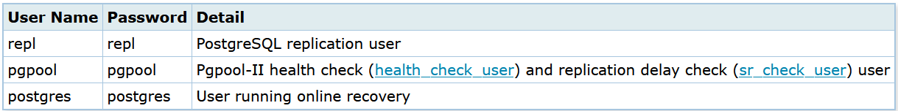

# Configuration on server master

### Create archive dir for archive mode
```
# mkdir -p /var/lib/pgsql/archivedir
# chown -R postgres:postgres /var/lib/pgsql/archivedir
```

### Edit file posgresql.conf
```
# vim /etc/posgresql/13/main/postgresql.conf

listen_addresses = '*'
archive_mode = on
archive_command = 'cp "%p" "/var/lib/pgsql/archivedir/%f"'
wal_level = replica
hot_standby = on
wal_log_hints = on
```

### create users

```
# su - postgres
$ psql
=# SET password_encryption = 'scram-sha-256';
=# CREATE ROLE pgpool WITH LOGIN;
=# CREATE ROLE repl WITH REPLICATION LOGIN;
=# \password pgpool
=# \password repl
=# \password postgres
=# GRANT pg_monitor TO pgpool;
```

